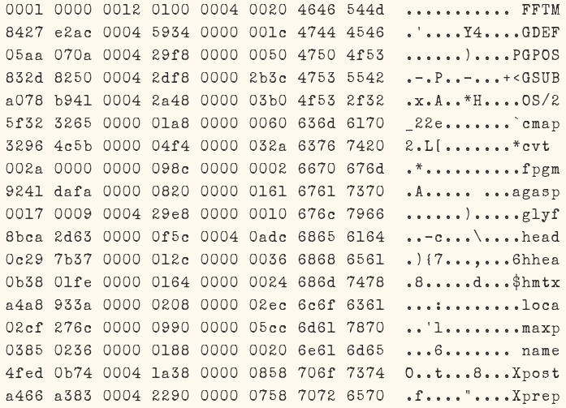

Ordinary Elite
==============

Ordinary Elite is based on the excellent Special Elite by Astigmatic, but with changed metrics so it can be used as a programming font and in terminal emulators as well.

Original text about "Special Elite":

"About Special Elite

Special Elite mimics the Smith Corona Special Elite Type Number NR6 and Remington Noiseless typewriter models.

A little bit of inked up grunge and a little old school analog flavor work together to give you a vintage typewriter typeface for your website and designs."

Original typeface at: https://fonts.google.com/specimen/Special+Elite

Please dont bug Astigmatic of botched metrics or other issues with this modification.

Screenshot
==========

License
=======

These fonts are licensed under the Apache License, Version 2.0.

You can use them freely in your products & projects - print or digital, commercial or otherwise.

This isn't legal advice, please consider consulting a lawyer and see the full license for all details. 